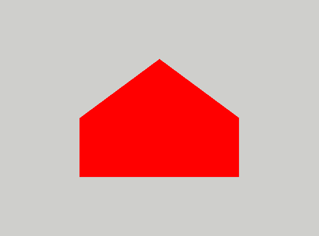

# House

1. Please copy the `src/Assignments/00_Triangle` directory to `src/Assignments/01_House` as described in
   [Preparing the assignments](../README.md#preparing-the-assignments). The simplest way is to use the provided script:
    ```shell
    python3 ./scripts/copy_assignment.py 00_Triangle 01_House
    ```
   (on Windows run it with `py` instead of `python3`). It copies the folder and changes the name of the project in
   `CMakeLists.txt` to `01_House`.

   The project name is the same as the directory name, including the number, and it is also the name of the program
   built from it.

2. Rebuild everything by issuing the command
    ```shell
    cmake .. && cmake --build . -j 4
    ```
   in the `./build` directory. Or just use VS Code or your other favorite IDE.

3. If everything goes all right, then after executing the program
    ```
    ./build/src/Assignments/01_House/01_House
    ```
   you should again see the red triangle.
   You are now ready to play with the code.
   Please note that when using CLion, the executable is located in the `./cmake-build-debug/src/Assignments/01_House/`
   directory. Where to find the program with other IDEs and compilers is described in the
   [Running](../../README.md#running) section of the main README.

4. Find the place where the background color is set.
   Change it to something else.
   Change it back to light-gray, for better debugging do not use black or white.

5. Find where in fragment shader the color of the triangle is set.
   Change it to something else.
   Change it back to red.

6. Find the place in `app.cpp` file where positions of vertices are stored. Change the location of the
   vertices. What happens when one of the coordinates _x,y_ is outside the range [-1,1]? What if _z_ coordinate is
   outside this range? Does changing _z_ inside this range have any visible effect?

7. In the vertex shader `shaders/base_vs.glsl` replace the line setting `gl_Position` with
    ```glsl
    gl_Position = vec4(a_vertex_position.xyz, 2.0);
    ```
   that sets the _w_ coordinate to two. Before running the program, try to predict what you will see. Then change
   it back.

8. Add one more triangle. Remember to edit draw command in the `frame` function.

9. Draw a house
   by adding beneath the original triangle a rectangle of width 1.0 and height 0.5 made out of two triangles. This
   should be your final version that you should submit to your repository. It should look like this:

<p align="center"></p>
