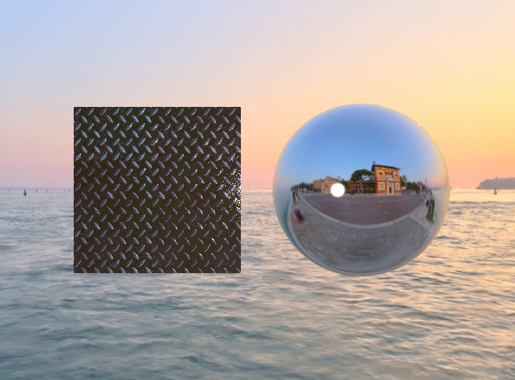

# Environment maps

So far the only light reaching our objects came from point lights and a constant ambient term. A polished metal,
however, reflects everything around it. In this assignment we will add such reflections using an _environment map_: an
image of the surroundings, seen from the position of the object, stored in a _cube map_ texture. We will also draw the
same environment as the background, a so-called _skybox_.

Start by copying the `15_od_BlinnPhongNormalMap` assignment to a new `15_oe_BlinnPhongEnvironment` directory, as
described in the [Preparing the assignments](../README.md#preparing-the-assignments) section.

## Cube maps

A cube map is a texture made of six square images, the faces of a cube centered at the origin. It is not indexed by
texture coordinates but by a _direction_: the lookup `texture(samplerCube, d)` returns the color of the point where the
ray from the center along `d` hits the cube. The vector `d` does not have to be normalized. The faces are, in order,
`GL_TEXTURE_CUBE_MAP_POSITIVE_X`, `GL_TEXTURE_CUBE_MAP_NEGATIVE_X`, ..., `GL_TEXTURE_CUBE_MAP_NEGATIVE_Z`, the faces
crossed by the positive and negative `x`, `y` and `z` axes.

The directory `Models/environment/venice_sunset` contains the six faces `px.jpg`, `nx.jpg`, `py.jpg`, `ny.jpg`,
`pz.jpg` and `nz.jpg` of the environment, made from the [Venice Sunset](https://polyhaven.com/a/venice_sunset)
panorama with the `scripts/equirect_to_cubemap.py` script. The `y` axis points up and the sun is along `-z`. You can
make your own cube map from any equirectangular panorama, e.g. one of the many on [Poly Haven](https://polyhaven.com/).

The orientation of the images inside the faces is fixed by the table "Cube Map Texture Selection" of the OpenGL
specification, which comes from the RenderMan conventions. Unlike our other textures, the first row of each image is
`t = 0`, so the faces must **not** be flipped when loading them.

1. Add the function

   ```c++
   gl::Texture create_cube_map_texture(const std::array<std::string, 6> &faces, bool is_sRGB = true);
   ```

   to `Engine/texture.h` and `Engine/texture.cpp`. It creates the texture with
   `glCreateTextures(GL_TEXTURE_CUBE_MAP, ...)` and allocates the storage for all six faces at once with
   `glTextureStorage2D`, with enough levels for the mipmaps. Then it loads each face with `stbi_load`, after calling
   `stbi_set_flip_vertically_on_load(false)`, and uploads it with

   ```c++
   OGL_CALL(glTextureSubImage3D(texture.get(), 0, 0, 0, face, size, size, 1, GL_RGB, GL_UNSIGNED_BYTE, img));
   ```

   For the DSA functions a cube map is an array of six layers, the `face` argument is the layer. Remember about
   `GL_UNPACK_ALIGNMENT`, as in `create_texture`. Finally generate the mipmaps with `glGenerateTextureMipmap`, set the
   minification filter to `GL_LINEAR_MIPMAP_LINEAR` and the wrapping in all three directions `S`, `T` and `R` to
   `GL_CLAMP_TO_EDGE`. The faces are colors, so they use the `GL_SRGB8` internal format.

2. In the `init` method of `SimpleShapeApplication` load the cube map into a new `gl::Texture environment_map_` field.
   Call also

   ```c++
   OGL_CALL(glEnable(GL_TEXTURE_CUBE_MAP_SEAMLESS));
   ```

   Without it each face is filtered on its own and the edges of the cube can become visible, especially in the
   smaller mipmap levels.

## Reflections

A mirror reflects the ray coming from the eye along the _view direction_ `-v` into the direction

```glsl
vec3 r = reflect(-v, n); // -v + 2 * dot(v, n) * n
```

and the color seen in the mirror is the color of the environment in the direction `r`: `texture(environment_map, r)`.
This assumes that the environment is infinitely far away, so only the direction matters and not the position of the
reflecting point. In particular, the objects do not reflect each other.

The MTL format has an illumination model for that: `illum 3` is the Blinn-Phong model of `illum 2` plus the reflection,
weighted by the specular color `Ks`. The `Models` directory contains two models using it: `square_environment.obj`, the
normal mapped metal plate from the previous assignment, and `sphere_environment.obj`, a unit sphere made of chrome.

1. Check that `Engine/mesh_loader.cpp` creates a `BlinnPhongMaterial` also for `illum 3`. The provided version already
   does (`case 3` shares the code of `case 2`); if your copy handles only `illum 1` and `2`, add it.

2. The environment is the same for all the materials. Add to `BlinnPhongMaterial` the static fields
   `GLuint environment_map_` and `glm::mat3 view_to_world_`, with the static setters `set_environment_map` and
   `set_view_to_world`, and the static uniform locations for the new uniforms

   ```glsl
   uniform samplerCube environment_map;
   uniform bool use_environment_map;
   uniform mat3 view_to_world;
   ```

   of the fragment shader. In `bind` set `use_environment_map`, and when the map is present, set `view_to_world` and
   bind the cube map to texture unit 5 with `glActiveTexture(GL_TEXTURE5)` and
   `glBindTexture(GL_TEXTURE_CUBE_MAP, ...)`. Unbind it in `unbind`.

   All sampler uniforms start at texture unit 0. A program in which samplers of _different types_, here `sampler2D` and
   `samplerCube`, that are used in the shader code refer to the same unit cannot be used for drawing at all: the draw
   call fails with `GL_INVALID_OPERATION`. This happens even if one of them is never actually sampled while drawing,
   e.g. because `use_environment_map` is `false`; only samplers that the compiler removes as unused do not count.
   That is why `environment_map` must be connected to unit 5 already in `init`, right after the program is created:

   ```c++
   OGL_CALL(glProgramUniform1i(program(), environment_map_location_, 5));
   ```

3. In the fragment shader, after the loop over the lights, add the reflection:

   ```glsl
   if (illum == 3 && use_environment_map) {
       vec3 view_dir = -normalize(vertex_position_vs);
       vec3 reflected_vs = reflect(-view_dir, normal);
       frag_color.rgb += specular_color * texture(environment_map, view_to_world * reflected_vs).rgb;
   }
   ```

   and compute the specular highlights for `illum == 3` too. The shader works in the view space, but the cube map
   describes the world, so the reflected direction must be rotated back to the world space. That is what
   `view_to_world` is for. The cube map has an sRGB format, so the colors read from it are already linear.

4. The view matrix of the camera is a rotation followed by a translation. The inverse of a rotation is its transpose,
   so in `frame`, before drawing the meshes, set

   ```c++
   xe::BlinnPhongMaterial::set_view_to_world(glm::transpose(glm::mat3(camera()->view())));
   ```

   and in `init` call `xe::BlinnPhongMaterial::set_environment_map(environment_map_.get())`.

5. Load both models. To place them next to each other each mesh needs its own model matrix: store it together with the
   mesh, e.g. in a `std::vector` of structs, and in `frame` compute and upload `PVM`, `VM` and `VM_normal` for each mesh
   before drawing it. Put the square at `(-1.2, 0, 0)`, the sphere at `(1.2, 0, 0)` and move the camera back to
   `(0, 0, 5.5)`. Move the light to `(0, 0, 2)` and increase its intensity to 4.

## Skybox

To draw the environment behind the objects we do not need a cube made of triangles. It is enough to cover the whole
screen with a single triangle and to compute in the fragment shader the direction in which the camera looks through
each pixel.

1. Create the shaders `shaders/skybox_vs.glsl` and `shaders/skybox_fs.glsl` in the assignment directory. The vertex
   shader has no input attributes: it builds the triangle with corners `(-1,-1)`, `(3,-1)` and `(-1,3)` from
   `gl_VertexID`, which covers the whole `[-1,1]x[-1,1]` square of the normalized device coordinates:

   ```glsl
   vec2 position = vec2((gl_VertexID << 1) & 2, gl_VertexID & 2) * 2.0 - 1.0;
   gl_Position = vec4(position, 1.0, 1.0);
   ```

   Setting `z = w` places the triangle exactly on the far plane, at depth 1.0. The direction is obtained by
   transforming this point back with the uniform `mat4 inverse_PV_rotation`, the inverse of the projection matrix
   times the rotation part of the view matrix:

   ```glsl
   vec4 world = inverse_PV_rotation * gl_Position;
   direction = world.xyz / world.w;
   ```

   The translation of the camera is left out because the environment is infinitely far away: moving the camera does
   not move the background, only rotating it does. The fragment shader looks up `direction` in a
   `uniform samplerCube environment_map;` and gamma corrects the color, like the Blinn-Phong shader.

2. In `init` create the program with `xe::utils::create_program` and an empty vertex array object. The triangle has no
   vertex attributes, but drawing still requires a bound VAO. Keep the program and the VAO in `gl::Program` and
   `gl::VertexArray` fields, and reset them, together with the cube map, in an overridden `cleanup` method, before
   calling `Application::cleanup()`: they must be deleted while the OpenGL context still exists.

3. At the end of `frame`, after the meshes, draw the skybox:

   ```c++
   auto PV_rotation = camera()->projection() * glm::mat4(glm::mat3(camera()->view()));
   ```

   set the uniform to its inverse, bind the program, the cube map to unit 0 and the VAO, and draw three vertices with
   `glDrawArrays(GL_TRIANGLES, 0, 3)`. Drawing the skybox last means that the fragment shader runs only for the pixels
   not covered by the objects. These pixels still have the depth 1.0 the depth buffer was cleared to, and with the
   default `GL_LESS` test a depth of 1.0 would not pass. So switch to `glDepthFunc(GL_LEQUAL)` for the skybox and back
   to `GL_LESS` afterwards.

   The skybox covers the whole screen, so the clear color is no longer visible.

The result should look like this:

<p align="center"></p>

## Checks

1. The sphere reflects what is _behind_ the camera: the buildings and the pavement, not the sun. The sky in the
   reflection is at the top and the pavement at the bottom. If the reflection is upside down or mirrored, the faces are
   loaded in a wrong order or flipped.

2. Rotate the camera around the sphere. The reflection must stay consistent with the background: the part of the sky
   or the sea seen next to the edge of the sphere continues in the background. If the reflection turns together with
   the camera, `view_to_world` is not applied or not updated in `frame`.

3. Rotating the camera also moves it, as it orbits around the origin. Temporarily leave the translation in the matrix,
   i.e. use `camera()->projection() * camera()->view()` instead of `PV_rotation`. The inverse then maps each pixel to a
   point on the far plane in world space, and the shader uses the vector from the _origin_ to this point as the
   direction. So the background is looked up as seen from the origin instead of from the camera. The camera looks at
   the origin from the distance 5.5, so the far plane is only `far - 5.5` away from the origin, instead of `far` from
   the camera: each pixel looks at the background at a larger angle from the center of the screen, as through a
   wide-angle lens. The background appears zoomed out and no longer matches the reflections. With the far plane at 20
   the top edge of the window shows the background 30 degrees up instead of 22.5; set the far plane to e.g. 7 and it
   shows 63 degrees up. Then revert the change.

4. Temporarily set `Kd` of the chrome to `1 1 1` and `Ks` to `0 0 0`. The sphere looks like a gray diffuse ball,
   without any reflection. Then try `Ks 1 1 1` for a perfect mirror. A real chrome reflects about 55-65% of the light.
   Our `Ks 0.9 0.9 0.9` is about 79% in linear space, so our chrome is a little brighter than the real one;
   `Ks 0.8 0.8 0.8`, about 60% in linear space, would be closer.

5. Comment out `glEnable(GL_TEXTURE_CUBE_MAP_SEAMLESS)` and look at the edges of the cube in the reflection on the
   bumpy metal plate, where the lookups use the smaller mipmap levels.
